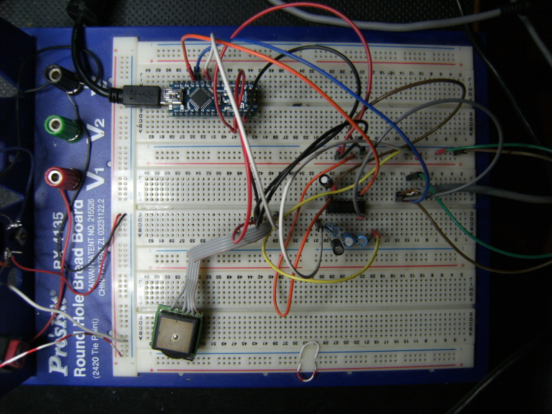

# thd7gps

This is a Arduino firmware able to convert NMEA 183.3 strings to NMEA 183.2.
It's necessary to let the old Kenwood TH-D7 hamradio rtx with unmodified firmware to work with new Nmea GPS.

The TH-D7 uses two NMEA sentences out of the many sent by the GPS unit every second: the $GPGGA and the $GPRMC.  
Early firmware version did not recognize the commas separating the various fields inside these sentences, using instead a fixed-length method that could lead to wrong data interpretation.

For Example:

NMEA 183.3 GPS sends:

$GPRMC,192944,V,3733.8310,N,01504.5017,E,20.0,270.8,081205,2.0,E,S*23
$GPGGA,192958,3733.8070,N,01504.4222,E,8,09,2.0,335.4,M,38.3,M,,*4A

NMEA 183.2 GPS sends:

$GPRMC,192944,V,3733.831,N,01504.501,E,20.0,270.8,081205,2.0,E,S*23
$GPGGA,192958,3733.807,N,01504.422,E,8,09,2.0,335.4,M,38.3,M,,*4A

Pay attention the checksum on these examble string are probably wrong.

The 4 decimal digits in the Lat and Long fields instead of the 3 expected by the TH-D7 are the source of the incompatibility.
The arduino code strips the extra digit and resent it to the TH-D7 in NMEA 183.2 format

The hardware in base on 

* Arduino nano
* GPS whit nmea output
* Max 232 level converter

Hardware and firmware is able to:

* receive the NMEA strings with a software serial port
* identify the $GPGGA and $GPRMC sentences
* remove the least significant decimal digits exceeding the 3 expected by the radio
* recalculate the checksum
* transmit the nmea string to the radio with a software serial port

###The hardware:
This is the testing hardware, actually on a breadboard

###LINKS:
Reference for gps compatibility http://www.qsl.net/n6qab/n6qabgps1.htm

(c) 2017 Paolo Mattiolo In3aqk

